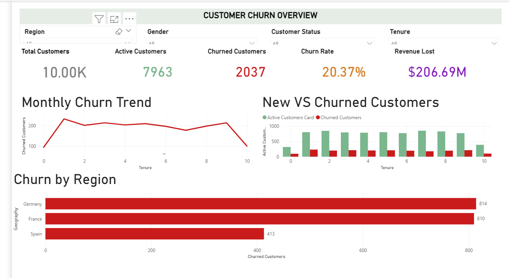

# 📉 Customer Churn Analysis Dashboard
Power BI | DAX | Data Modeling

## 🧠 Business Problem
Understanding why customers churn and identifying high-risk segments is critical to improving retention and minimizing revenue loss.

## 📊 Key KPIs
- Total Customers
- Active Customers
- Churned Customers
- Churn Rate (%)
- Revenue Lost

## 📈 Dashboard Features
- Interactive slicers for Region, Gender, Customer Status, and Tenure
- Churn trend analysis by customer tenure
- Comparison of active vs churned customers
- Regional churn and revenue loss analysis

## 🔍 Key Insights
- Churn is highest during early customer tenure
- Certain regions contribute disproportionately to churn and revenue loss
- Revenue loss increases significantly with higher churn concentration

## 📌 Business Impact
- Enables retention teams to prioritize early-tenure customers
- Helps businesses target high-churn regions with focused retention strategies
- Supports data-driven decision-making in marketing and operations

## 🛠 Tools & Technologies
- Power BI Desktop
- DAX
- Data Modeling
- Data Visualization

Cleaned analytical tables and insights summary

## 📂 Files Included
- `Customer_Churn_Analysis.pbix` – Power BI dashboard file
- `dashboard_overview.png` – Dashboard preview image
- 'bank churn 2' - dataset

## 🚀 How to Use
1. Download the `.pbix` file
2. Open in Power BI Desktop
3. Interact with slicers to explore insights
---

---- the dataset provided is not cleaned
